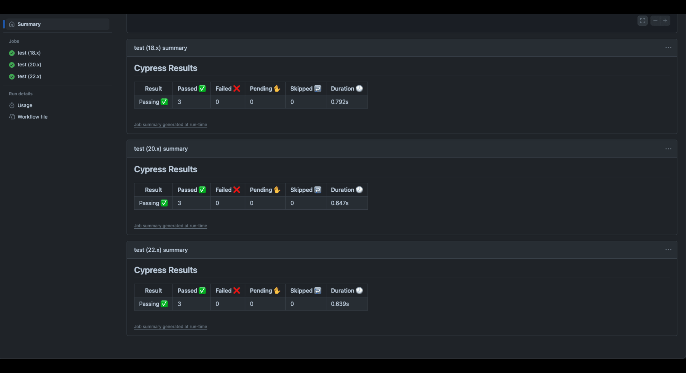

# GitHub Actions CI/CD Setup

## Project Summary

This project demonstrates the integration of Continuous Integration (CI) and Continuous Deployment (CD) using GitHub Actions, with automatic deployment to Render. The task involves creating a CI/CD pipeline that automatically runs Cypress component tests when a Pull Request (PR) is made to the `develop` branch and deploys the application to Render when code is merged from the `develop` branch to the `main` branch.

This pipeline is an essential aspect of modern web development as it ensures code quality and automatic deployment to production, minimizing human intervention. By integrating CI/CD practices, the development process becomes more reliable and faster, allowing developers to push changes with confidence knowing that tests will automatically run and deployments will occur without manual oversight.

### Problem & Approach

The main objective of this project is to set up automated testing and deployment pipelines to ensure that the application maintains high-quality standards and is always up to date in production. By using GitHub Actions, the project automates two key processes:

1. **Cypress Test Execution**: When a Pull Request is made to the `develop` branch, Cypress component tests are executed through GitHub Actions. This ensures that any new code added to the project integrates seamlessly and doesn't introduce any issues.
   
2. **Automatic Deployment**: Once the tests pass, and the code is merged into the `main` branch, GitHub Actions triggers a deployment to Render using a pre-configured deploy hook.

These processes aim to ensure that code is tested before deployment and that the application is always deployed automatically without manual intervention, thus improving the workflow efficiency and application reliability.

## Table of Contents

- [Usage](#usage)
- [Mock-Up](#mock-up)
- [Instructions](#instructions)
- [Key Features](#key-features)
- [Technology Stack](#technology-stack)
- [Additional Resources](#additional-resources)

## Usage

To start the application and run the necessary GitHub Actions workflows, follow these steps:

### 1. Clone the repository:
```
git clone git@github.com:gilmerperez/github-actions-ci-cd-setup.git
cd github-actions-ci-cd-setup
```

### 2. Install Dependencies:
Make sure all required dependencies are installed before starting the application.
```
npm install
```

### 3. Ryn Cypress Tests:
```
npm run test
```

### 4. Deploy to Render:
Whenever changes are merged to the main branch, GitHub Actions will automatically deploy the application to Render.

## Mock-Up

The following images show how the GitHub Actions workflows should look for both tests and deployments:

Your GitHub Actions for tests should look similar to the image below:


Your GitHub Actions for deployments should look similar to the image below:


## Instructions

### 1. Set Up the Project

- Clone the repository to your local machine.
- Set up a Render account and follow the steps to deploy the application.
- Make sure the develop branch exists and is used for all feature development.

### 2. Configure GitHub Actions:

- Set up two `.yml` files in your `.github/workflows/` folder:
- main.yml: This file will trigger Cypress tests on Pull Requests to the `develop` branch.
- deploy.yml: This file will deploy the app to Render when changes are merged into the `main` branch.

### 3. Push Changes:

- After adding your features, create a Pull Request to the `develop` branch.
- Ensure that Cypress tests pass in GitHub Actions.
- Merge the Pull Request to `main`, and the app will automatically be deployed to Render.

## Key Features

- **Automatic Deployment:** Once the code is merged into the `main` branch, the app is deployed to Render automatically without manual intervention.
- **Cypress Component Testing:** Cypress tests are automatically triggered whenever a PR is made to the `develop` branch. This ensures that the application maintains high quality.
- **GitHub Actions CI/CD Workflow:** The integration of GitHub Actions with CI/CD pipelines enables seamless and automatic execution of tests and deployment to the production environment.

## Technology Stack

This project utilizes the following tools and technologies:
- **Render:** A platform used to deploy the application automatically.
- **Cypress:** A testing framework that runs component tests on the application.
- **MongoDB:** Used to store data for the application in a cloud-hosted database.
- **GitHub Actions:** Used to automate the workflows for both testing and deployment.

## Additional Resources

- Deploy Hooks: [Render Documentation](https://render.com/docs/deploy-hooks)
- The Render API: [Render Documentation](https://render.com/docs/api)
- Main and Develop Branches: [GitHub Workflow](https://www.atlassian.com/git/tutorials/comparing-workflows/gitflow-workflow)
- GitHub Repo Secrets: [Using secrets in GitHub Actions](https://docs.github.com/en/actions/security-for-github-actions/security-guides/using-secrets-in-github-actions)
- Deployed Application: [Render Deployment](https://github-actions-ci-cd-setup-8us2.onrender.com)
- GitHub Repository: [gilmerperez/github-actions-ci-cd-setup](https://github.com/gilmerperez/github-actions-ci-cd-setup)

